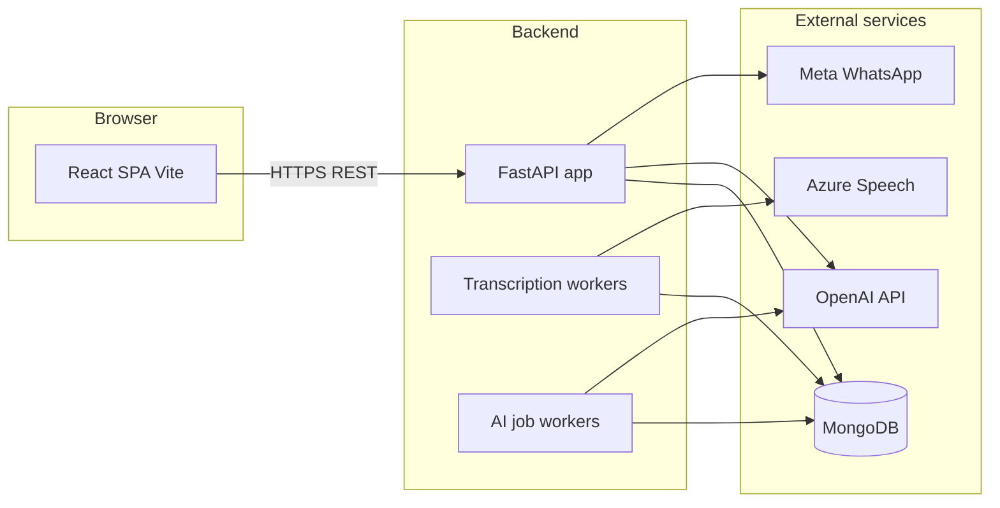

# Technical overview — Clinic AI India

This document summarizes how the system is structured for engineers onboarding or handing off the codebase. It does not replace environment-specific runbooks.

## High-level architecture

- **Frontend (`clinic_ai_frontend/src`):** Route-level pages for auth, onboarding, dashboard, calendar, visits, patients, templates, settings, and care-prep intake. Shared API access goes through `src/lib/apiClient.ts` and service modules under `src/services/`.
- **Backend (`clinic_ai_backend/src`):** Clean-architecture-style layout:
  - **`api/`** — FastAPI routers, Pydantic schemas, dependencies.
  - **`application/`** — Use cases, DTOs, ports.
  - **`domain/`** — Entities and domain logic (where present).
  - **`adapters/`** — MongoDB repositories, OpenAI/Azure/WhatsApp clients, storage, queues.
  - **`workers/`** — Background transcription processing and AI job polling.
  - **`core/`** — Configuration, factories, shared utilities.

Configuration is loaded from `clinic_ai_backend/.env` via `src/core/config.py` (`Settings`).

## API entry points

| Entry | Role |
|-------|------|
| `startup.py` | Uvicorn entry; binds `API_HOST` / `API_PORT`. |
| `worker_startup.py` | Standalone transcription worker process (production-style split). |
| `sweeper_startup.py` | Sweeper / maintenance process (see Makefile). |
| `src/app.py` | `create_app()` registers routers and middleware; mounts lifespan hooks for in-process workers. |

## HTTP routers (selected prefixes)

Routers are registered in `src/app.py`. Representative prefixes:

| Prefix / tag | Module | Purpose |
|--------------|--------|---------|
| `/health` | `health.py` | Liveness / readiness style checks |
| `/api/auth` | `auth.py` | Authentication |
| `/api/patients` | `patients.py` | Patient CRUD / listing |
| `/api/visits` | `visits.py` | Visits and related workflows |
| `/api/notes` | `notes.py`, `transcription.py` | Clinical notes, uploads, transcription sessions |
| `/api/templates` | `templates.py` | Note templates |
| `/api/vitals` | `vitals.py` | Vitals capture |
| `/api/workflow` | `workflow.py` | Workflow automation (e.g. cron-guarded jobs) |
| `/api/contextai` | `contextai.py` | Context AI features |
| `/api/patient-chat` | `patient_chat.py` | Patient chat flows |
| `/api/follow-through` | `followthrough.py` | Follow-through workflows |
| WhatsApp routes | `whatsapp.py` | Webhooks and Meta integration |
| AI intake | `intake.py` | AI-assisted intake |
| `/api/ai-jobs` | `ai_jobs.py` | Async AI job tracking |

Exact paths and payloads are defined in each router and `src/api/schemas/`. Treat them as **stable contracts** unless you version the API.

## Data storage

- **MongoDB** stores application documents (patients, visits, notes, jobs, etc.).
- **GridFS** (when using a full PyMongo database) stores audio blobs for transcription; local dev may use `USE_LOCAL_ADAPTERS=true` and `LOCAL_AUDIO_STORAGE_PATH` for file-backed audio when not using GridFS.

## Frontend routing

`clinic_ai_frontend/src/App.tsx` defines React Router routes: public auth/onboarding routes and nested routes under `ProviderLayout` for the signed-in experience. `main.tsx` sets `basename` from Vite `BASE_URL` for subdirectory deployments.

## Build and quality gates

- **Frontend:** `npm run build` runs TypeScript project references then Vite build.
- **Backend:** `make lint` (Ruff), `make test` (pytest). CI workflows live under `clinic_ai_backend/.github/workflows/`.

## Risk-sensitive areas (test after changes)

- Transcription pipeline (chunking, ffmpeg, Azure Speech, queue semantics).
- WhatsApp webhook verification and template parameter counts.
- JWT / encryption settings (`ENCRYPTION_KEY`, `JWT_SECRET_KEY`).
- CORS and preview-domain regex for frontend deployments.

For deeper operational detail (languages, diarization limits, intake flags), see `clinic_ai_backend/README.md` and `clinic_ai_backend/docs/TRANSCRIPTION_LONG_AUDIO.md`.
